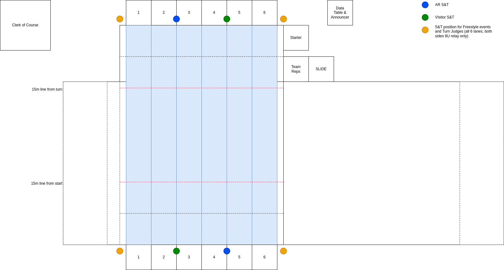

# Adelphi Dolphins Officials Information

## Preparation 

* Standard uniforms apply:  navy shorts, pants or skirt and a white polo top.
* Bring a refillable water bottle and stay hydrated.
* Wear a hat.
* Use sunscreen.
* Have a rain jacket handy in case the weather turns poor.
* Maybe have some snacks in your pocket.  Generally someone will come around and offer water and likely snacks.
* We will have our officials briefing at 8:00am.  It will be at the picnic table behind the data table (look for the other white shirts!).
* Please check in with the data table when you arrive. This will be on deck by the slide.  Write your name, phone number, and team.
* Please give the rule book and handbook a re-read before arriving at the meet:
  * 2024 Rules: https://websitedevsa.blob.core.windows.net/sitefinity/docs/default-source/governance/governance-lsc-website/rules_policies/rulebooks/2024-mini-rulebook.pdf
  * 2024 PMSL Handbook: https://princemont.org/2023/2023_PMSL_Handbook.pdf
* If you are running late or for some reason can't make it, please a team respresentative know (if you are an Adelphi (AR) official, please call Don Badrak, Naomi Chavez, or Becky Widman).

## Pool Details

* The pool is 25m, with backstroke flags at 5m on both ends.
* It is 5 ft deep throughout the course, at both the start and turn ends.
* Outside of lane 1 and 6 (to the wall) is a 1 ft buffer containing the ladders, which have a lane rope protecting it.
* The start end is closest to the fence. The turn end is closest to the pool house. There are 6 lanes.
* The lane lines are marked in red for 15m (each direction). We'll have a marking on the pool deck (by the diving boards) for 15m. We will observe this with a Chief Judge (CJ).
* We will not walk for stroke in any event.
* The coping stones have a 1/2 inch lip from the wall.
* There is no gutter.  The top edge of the pool is about 6 inches or more from the water line.
* For 25m events (8U events, 10U butterfly), the timers will move to the turn end, which will be the finish end for the swimmers.  A CJ will be located at the turn end.

## Stoke Briefing

* Backstroke
  * Watch for grabbing on the lane rope and pulling, not just pushing away.
* Butterfly
* Breakstroke
* Freestyle
* Individual Medley
* Freestyle Relay
* Medley Relay
* The benefit of the doubt goes to the swimmer.
* If you see a violation, raise your hand for 3-5 seconds, and jot down what you observed on the program.  This is not a DQ necessarily, but an invitation for a discussion.
You write it down as you may have a number of violations in a short time period and you have to explain to the referee or CJ when they chat with you.
* Be ready to describe your observation in terms of the rule book style of violation.
If it is a single hand touch, note which hand, and where the other hand was located.  Note where the violation occurs (which pool length, which stroke for IM, approaching the turn or leaving the
wall, etc.).
* The CJ will take order of finish for the 25m events (turn end).
* The CJ will adjudicate violations at the turn end, and will place their initials next to the judge's name. The referee approves or rejects all DQs.

## Jursidiction

* Four S&Ts will be used, two at each end. There will be two S&Ts from Adelphi (home) and two from the visiting team.  If more than 2 per team, S&T will rotate with
their own team's S&T(s) when we change events.
* See the diagram for positioning for S&T.  To start, AR is start 1-3, visitor start 4-6, AR turn 4-6 and visitor turn 1-3.
* Each S&T will watch 3 lanes and half the pool.
* S&T will be positioned as follows:
  * lanes 1,2,3 on the line between 2 and 3 (two lanes to one side, one to the other)
  * lanes 4,5,6 on the line between 4 and 5 (two lanes to one side, one to the other)
* Step up to the wall when the swimmer is in your jurisdiction, and step back when they leave.
* You will need to step fully to the edge and lean over to see the wall due to the 1/2 inch lip.
* At the start end, stay back for the start (3 ft or more), and step forward after the start.  If you see timers too close to the start, remind them too to step back.
* Freestyle events will have S&T at corners (lane 1 and lane 6 sides), watching that the swimmer touches the wall (as well as other potential violations).
* S&Ts will rotate after each evens (6 total event/event groups, 4 total rotations).  After the break, S&T will return to their positions held during IM, which is also the starting positions.
  * after butterfly (events 1-10)
  * after free (events 11-20)
  * after breast (events 21-30)
  * after back (events 31-40)
  * do IM (events 41-46), break, relays (events 47-49), then done
* We will rotate clockwise.
* After the break we will do the 8U relay and the 200 FR
* For relay take off judging, we will watch all 6 lanes (from the outside of lane 1 and 6):
  * 200m MR (events 1,2) -- 4 S&T in stoke and turn positions, and 2 take-off judges on the start end (starter/ref or extra S&Ts if we have them).
  * 100m 8U FR (event 47)-- 2 S&T judges at the start end, 2 S&T judges at the turn end.  The S&T will act as takeoff judges.
  * 200m FR (events 48,49) -- 2 S&T judges at the start end only. The S&T will act as takeoff judges.  Judges must also watch for touches of the wall before the relay exchange.
* Take off judges (TOJ) will watch all 6 lanes, looking for the feet of the outgoing swimmer to leave the wall, and then at the incoming swimmer to be sure they have touched.  If the touch happens
before the feet leave, circle that swimmer number on the TOJ sheet.  If touch has not happened, mark an X in that swimmer number.  Do not raise your arm for this call.
We require dual confirmation.  The referee will confer with the closest TOJ. If there is no violation, they will not check the other TOJ. 
* The S&T will need to look for suit and taping violations.  Please raise your hand if you see this and note it on your program.
  * Improper suits
  * Any sort of kinetic support tape
  * We will try to have identified any suit waivers in advance.
